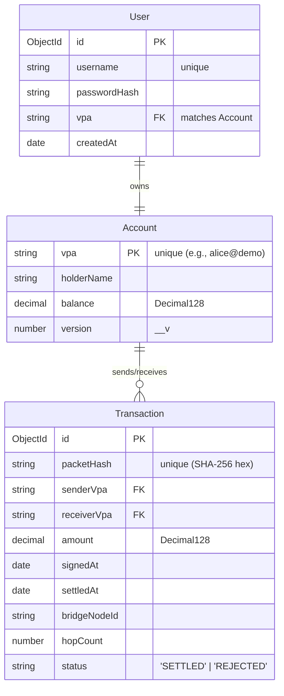

# UPI Without Internet — MERN Stack Migration

A production-grade, secure, and offline peer-to-peer digital payment routing system migrated from Spring Boot to a modern **MERN (MongoDB, Express, React, Node)** stack with TypeScript. 

This project simulates the gossip protocol over a Bluetooth Low Energy (BLE) mesh network, allowing users in connectivity-shadowed environments (e.g., basements, subways, rural areas) to perform secure transaction signings offline. The encrypted packets propagate device-by-device until they reach an online gateway bridge node (4G/5G) which settles them securely at the central server.

---

## 📡 System Architecture & Data Flow

```mermaid
sequenceDiagram
    autonumber
    actor Alice as Alice (Sender)
    actor Bob as Bob (Receiver)
    actor Stranger as Stranger (Hop Node)
    actor Bridge as Bridge (Node with 4G)
    participant Server as Settlement Server
    participant Redis as Redis Cache
    participant DB as MongoDB

    Note over Alice, Bob: Offline Zone (No Internet)
    Alice->>Alice: Enters amount & PIN
    Alice->>Alice: Creates PaymentInstruction
    Alice->>Alice: Hybrid Encrypts payload with Server Public Key
    Alice->>Bob: Transmit MeshPacket via BLE / Mesh
    Note over Bob, Stranger: Mesh Propagation
    Bob->>Stranger: Gossip Packet (TTL decrements)
    Stranger->>Bridge: Gossip Packet
    Note over Bridge: Bridge walks outside (Gets 4G)
    Bridge->>Server: HTTP POST /api/bridge/ingest (MeshPacket)
    
    rect rgb(30, 41, 59)
        Note over Server: Server-side Ingestion Pipeline
        Server->>Server: Hash base64 Ciphertext (SHA-256)
        Server->>Redis: SETNX idempotency:hash (with TTL)
        alt Cache hit (already exists)
            Redis-->>Server: Error / Already set
            Server-->>Bridge: Return DUPLICATE_DROPPED
        else Cache miss (first time)
            Redis-->>Server: OK (Claimed)
            Server->>Server: Decrypt AES Key using RSA Private Key
            Server->>Server: Decrypt Payload using AES-256-GCM
            Server->>Server: Check Freshness (signedAt <= 24 hours)
            Server->>DB: Fetch Sender & Receiver Accounts (Session / Transaction)
            Server->>DB: Validate Balance >= Amount
            Server->>DB: Deduct Balance from Sender, Add to Receiver (with Version Check)
            Server->>DB: Write Transaction (packetHash unique)
            Server-->>Bridge: Return SETTLED
        end
    end
```



---

## 🔒 Cryptographic Scheme (Byte-Identical Compatibility)

To prevent intermediary devices from tampering with or reading the transactions, we implement a **Hybrid Cryptography Protocol** identical to TLS/Signal:

1. **RSA-2048 (OAEP with SHA-256 & MGF1 SHA-256)**: Used to encrypt a one-time symmetric AES session key.
2. **AES-256-GCM (12-byte IV, 16-byte Tag)**: Used to encrypt the JSON Payment Instruction payload.

### Wire Serialization Format
The packets are serialized into a packed binary buffer before being base64-encoded:
```
+------------------------------+--------------------+-----------------------------+
| RSA-Encrypted AES Key (256B) |  GCM IV (12 Bytes) | AES Ciphertext + Tag (Var)  |
+------------------------------+--------------------+-----------------------------+
```

---

## 🗄️ Database Collections Schema (MongoDB)



---

## 🛠️ Technology Stack

### Frontend
- **React 19** & **Vite** (TypeScript)
- **Tailwind CSS** (Premium dark glassmorphic styling)
- **Lucide Icons**
- **Axios** (REST client)
- **TanStack Query** (Caching and synchronization)
- **React Router** (Navigation structures)

### Backend
- **Node.js** & **Express.js** (TypeScript)
- **MongoDB** & **Mongoose** (Decimal128 ledger balances, transaction sessions)
- **Redis** (Distributed idempotency key registration using `SETNX`)
- **Native crypto** (Byte-identical encryption compatibility layers)
- **Winston** (Structured JSON logger)
- **Swagger / OpenAPI** (Interactive developer API catalog)

---

## 🚀 Running the Project

### Prerequisites
- [Docker](https://www.docker.com/) and Docker Compose installed.
- (Optional for host running) Node.js v20+ and MongoDB/Redis.

### Standard Setup (Docker Compose)
To spin up the entire production-ready environment (MongoDB, Redis, Settlement Server, and React Frontend UI):

1. Clone and navigate to the project directory:
   ```bash
   cd upi-offline-mern
   ```
2. Build and run the services:
   ```bash
   docker-compose up --build
   ```
3. Access the interfaces:
   - **Frontend UI Dashboard**: [http://localhost:3000](http://localhost:3000)
   - **Interactive API Documentation (Swagger)**: [http://localhost:8080/api-docs](http://localhost:8080/api-docs)

### Local Dev Setup (Host Environment)
If you want to run the server and client directly on your host machine:

#### 1. Setup Server
```bash
cd server
npm install
npm run dev
```

#### 2. Setup Client
```bash
cd ../client
npm install
npm run dev
```
*(The React application will be hosted on http://localhost:5173)*
